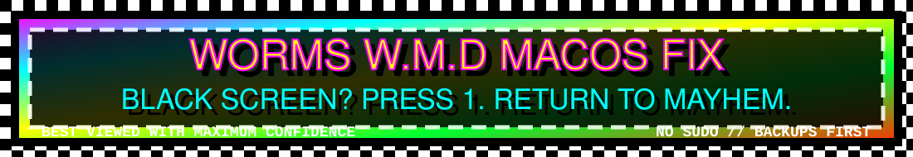
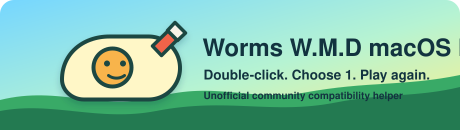
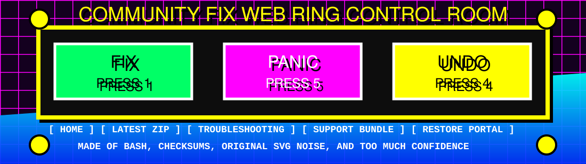

# Worms W.M.D macOS Fix

## Run This First

1. Download the [latest release zip](https://github.com/cboyd0319/WormsWMD-macOS-Fix/releases/latest).
2. Unzip it.
3. Double-click `Worms W.M.D Fix.command`.
4. Press `1`.

If macOS blocks it, right-click `Worms W.M.D Fix.command`, choose **Open**,
then choose **Open** again. If the fix fails, run the same file again and press
`5` to create a support bundle on your Desktop.

---

<div align="center">

<pre>
 __        __                         __        __   __  __   ____
 \ \      / /__  _ __ _ __ ___  ___  \ \      / /  |  \/  | |  _ \
  \ \ /\ / / _ \| '__| '_ ` _ \/ __|  \ \ /\ / /   | |\/| | | | | |
   \ V  V / (_) | |  | | | | | \__ \   \ V  V /    | |  | |_| |_| |
    \_/\_/ \___/|_|  |_| |_| |_|___/    \_/\_/     |_|  |_(_)____/

                         Worms W.M.D
                 macOS BLACK SCREEN REPAIR ZONE
</pre>



<marquee behavior="alternate" scrollamount="12">
<b>!!! PRESS 1 TO FIX !!! NO SUDO !!! BACKUPS FIRST !!! QT 5.15 TIME MACHINE !!! UNDER CONSTRUCTION FOREVER !!!</b>
</marquee>

<br />

<a href="https://github.com/cboyd0319/WormsWMD-macOS-Fix/actions/workflows/ci.yml"></a>
<a href="https://opensource.org/licenses/MIT"></a>
<a href="https://www.apple.com/macos/"></a>
<a href="https://github.com/cboyd0319/WormsWMD-macOS-Fix/releases/latest"></a>
<a href="SECURITY.md"></a>
<a href="ATTRIBUTIONS.md"></a>
<a href="#worms-wmd-macos-fix"></a>

<br />


<br />



<br />


<br />


<br />


</div>

---

## Welcome To The Questionable Website For A Very Useful Button

Your game launches. The screen goes black. Everybody stares at it. The computer
acts like this is normal. This repo shows up wearing seven badges, a fake
visitor counter, and exactly one serious purpose: make the four-step answer
above hard to miss.

That is the whole normal-person path. Everything else on this page is either a
safety explanation, a support escape hatch, or decorative old-web noise taped to
the outside for morale.

No `sudo`. No system-wide surgery. No game files included. No official
Team17/Worms art bundled. Just a community fix, a backup, and a menu that tries
very hard not to make you learn Terminal.

## Absolutely Unnecessary Emergency Control Room

<div align="center">



</div>

This is the whole control panel in less dramatic words:

- Want the fix? Press `1`.
- Want to see what would happen first? Press `2`.
- Want proof it worked? Press `3`.
- Want to undo it? Press `4`.
- Want help without explaining computers? Press `5`.
- Want the little help page? Press `6`.

## Giant Flashing Button Map

The launcher is just a menu. Option `1` is the main path. The other buttons are
there when you want to preview, check, restore, or ask for help.

<table>
<tr>
<th>Button</th>
<th>What It Does In Human Words</th>
</tr>
<tr>
<td><code>1</code></td>
<td>Applies the recommended fix. This is the big friendly button.</td>
</tr>
<tr>
<td><code>2</code></td>
<td>Shows what would change before changing anything.</td>
</tr>
<tr>
<td><code>3</code></td>
<td>Checks whether the fix is already installed.</td>
</tr>
<tr>
<td><code>4</code></td>
<td>Restores original files from a backup.</td>
</tr>
<tr>
<td><code>5</code></td>
<td>Creates a sanitized support bundle on your Desktop.</td>
</tr>
<tr>
<td><code>6</code></td>
<td>Opens the simple help file.</td>
</tr>
</table>

## Steam Forum Speedrun

```text
BLACK SCREEN?        yes
DOWNLOADED ZIP?      yes
DOUBLE-CLICKED FILE? Worms W.M.D Fix.command
PRESSED BUTTON?      1
SUDO?                no
BACKUP?              automatic
PANIC LEVEL?         optional
```

If anything fails, run `Worms W.M.D Fix.command` again and choose option `5`.
That puts a support bundle on your Desktop so you can open an issue without
writing a detective novel about your Mac.

## Guestbook Of Extremely Specific Promises

Sign here with your eyes only:

```text
[x] I will not be asked for an admin password.
[x] The fix backs up game-bundle files before changing them.
[x] The repo does not ship official Worms art, game binaries, or save files.
[x] The support button tries to sanitize useful diagnostics for bug reports.
[x] The fun parts are silly. The installer parts are meant to be boring.
```

## Choose Your 1998 Web Portal

| I Am... | Click This Portal |
| --- | --- |
| A normal player who wants the game to work | Download the [latest release zip](https://github.com/cboyd0319/WormsWMD-macOS-Fix/releases/latest), unzip it, double-click `Worms W.M.D Fix.command`, press `1`. |
| A normal player who downloaded only one file | Download [`Install Fix.command`](https://github.com/cboyd0319/WormsWMD-macOS-Fix/raw/main/Install%20Fix.command), double-click it, then press `1` in the launcher it opens. |
| Blocked by macOS | Right-click the `.command` file, choose **Open**, then choose **Open** again. If needed, see [Troubleshooting](docs/TROUBLESHOOTING.md#install-fixcommand-wont-run). |
| A Terminal person who enjoys tiny incantations | Run the command in the next section. |
| A maintainer, investigator, or brave lever-puller | Start with [docs/INSTALL.md](docs/INSTALL.md), [docs/TECHNICAL.md](docs/TECHNICAL.md), and [docs/TOOLS.md](docs/TOOLS.md). |

## Tiny Incantation Zone

```bash
curl -fsSL https://raw.githubusercontent.com/cboyd0319/WormsWMD-macOS-Fix/main/install.sh | bash
```

Requires `git` (install Xcode Command Line Tools if missing). With no command
line flags and an interactive Terminal, it opens the same friendly launcher
menu. The menu is the main event; the command is only a faster doorway.

## What Kind Of Magic Is This?

Not magic, sadly. Just a carefully labeled box of small repairs:

- **The black-screen antidote:** adds an AGL stub framework so macOS 26+ can
  launch the game.
- **The Qt time machine:** replaces the very old bundled Qt 5.3.2 runtime with
  Qt 5.15.
- **The safety net:** creates restorable backups with manifests before changing
  files.
- **The package bouncer:** verifies Qt package checksums, metadata, manifests,
  and x86_64 slices before using them.
- **The window un-shrinker:** resets incompatible old Qt window geometry.
- **The support button:** creates a sanitized support bundle so players do not
  have to describe mysterious computer smoke in a forum post.

## Fake Awards Shelf

| Badge | Meaning |
| --- | --- |
| `MOST LIKELY TO SAY PRESS 1` | The README refuses to hide the useful answer. |
| `NO SUDO ENERGY` | The fix stays inside user-writable project and game-bundle paths. |
| `BACKUP GOBLET` | Restorable backups are part of the normal apply path. |
| `SUPPORT BUNDLE FAX MACHINE` | Option `5` creates a report players can attach to an issue. |
| `UNOFFICIAL BUT TRYING` | This is a community project, not a Team17 product. |

## Panic Decoder Ring

| Weird Thing | Translation |
| --- | --- |
| The screen is black | The old game is asking modern macOS for an old graphics API doorway called AGL. |
| The fix adds an AGL stub | It gives the dynamic linker the missing symbols the old launch path expects. |
| Qt gets refreshed | The bundled Qt 5.3.2 runtime is replaced with Qt 5.15-compatible pieces. |
| Backups happen first | You can restore changed files from the launcher. |
| No official art is here | The repo is unofficial and only ships original project visuals. |

## Requirements

- Target: macOS 26 (Tahoe) or later. Earlier macOS versions typically don't
  need the AGL fix, but macOS 15.x users with keyboard input buffering or lag
  may benefit from the Qt 5.15 refresh.
- Worms W.M.D installed via Steam or GOG
- Internet connection
- git (installed by Xcode Command Line Tools)

The script can prompt to install these if needed (you may see system prompts):

- Rosetta 2 (Apple Silicon)
- Xcode Command Line Tools
- Qt frameworks (downloaded from GitHub; Homebrew fallback)

## What The Fix Does

- Adds an AGL stub framework so the game launches on macOS 26+.
- Replaces Qt 5.3.2 with Qt 5.15.
- Verifies pre-built Qt package checksums, metadata, manifests, and x86_64
  slices before use.
- Bundles required dependencies and fixes install names.
- May resolve keyboard input buffering or lag caused by the original Qt 5.3.2
  runtime.
- Updates Info.plist (bundle ID, HiDPI support, minimum version).
- Fixes known HTTP URLs in DataOSX/CommonData config files.
- Comments out internal/staging URLs in DataOSX config files.
- Clears quarantine flags and applies ad-hoc signing.
- Resets incompatible Qt window geometry to fix small window issues.
- Creates restorable backups with manifests for integrity checks.

## Pre-Flight Check

Before launching, you can verify your system is ready:

```bash
./tools/preflight_check.sh
```

This checks:

- macOS version and architecture
- Rosetta 2 status (Apple Silicon)
- Game installation and fix status
- Runtime dependencies
- Network connectivity to Team17 and Steam endpoints

Use `--quick` to skip network checks, or `--verbose` for detailed output.

## Documentation Web Ring

- [Documentation index](docs/README.md) - Complete durable docs map
- [Support](SUPPORT.md) - Normal-person issue reporting and support bundles
- [Attributions](ATTRIBUTIONS.md) - Asset and unofficial-project policy
- [Steam post template](STEAM_POST.md) - Copy/paste community support text
- [What this fix improves](docs/IMPROVEMENTS.md) - All fixes and enhancements explained
- [Installation](docs/INSTALL.md) - Manual install and restore options
- [Troubleshooting](docs/TROUBLESHOOTING.md) - Solutions for common problems
- [FAQ](docs/FAQ.md) - Frequently asked questions
- [Tools](docs/TOOLS.md) - Helper utilities reference
- [Technical details](docs/TECHNICAL.md) - How the fix works
- [Agent harness](docs/style/agent-harness.md) - Repo-local agent workflow and validation standard
- [Security](SECURITY.md) - Security information
- [Contributing](CONTRIBUTING.md) - How to contribute
- [Changelog](CHANGELOG.md) - Version history
- [Team17 Developer Report](TEAM17_DEVELOPER_REPORT.md) - Technical report for Team17

## Support

- Issues: https://github.com/cboyd0319/WormsWMD-macOS-Fix/issues
- If a player is stuck, ask them to run `Worms W.M.D Fix.command` and choose
  option `5` to create a sanitized support bundle on the Desktop.

## Credits

- Steam community for reporting the issue
- Qt Project for Qt 5.15
- Original project badge and release visuals are included under this repo's
  license; no official Team17/Worms art is bundled.
- Fix developed with AI assistance

## Links

- [Worms W.M.D on Steam](https://store.steampowered.com/app/327030/Worms_WMD/)

Steam discussion threads about this issue:

- [Can't open on macOS Tahoe M2](https://steamcommunity.com/app/327030/discussions/2/594035123771846058/)
- [Black screen on Mac Pro 2019 16](https://steamcommunity.com/app/327030/discussions/2/686363730790074305/)
- [Black screen on macOS](https://steamcommunity.com/app/327030/discussions/2/686365524184117509/)
